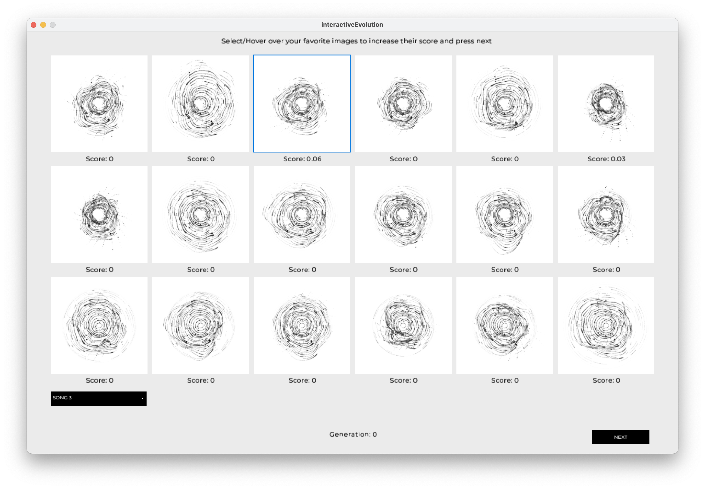
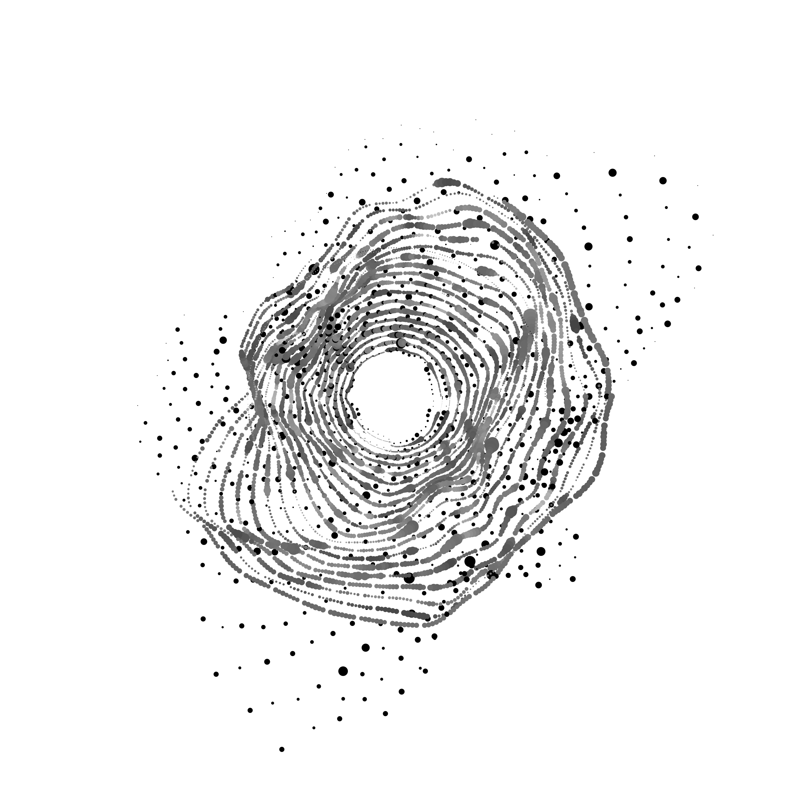

# Interactive Evolutionary System

Interactive evolutionary system that generates graphic artefacts inspired by features taken from musical pieces

@AlexandraCordeiro
@tatiana-lopes

    
    

## Utils

- [Processing](https://processing.org/)
- [Librosa](https://librosa.org/doc/main/index.html)

